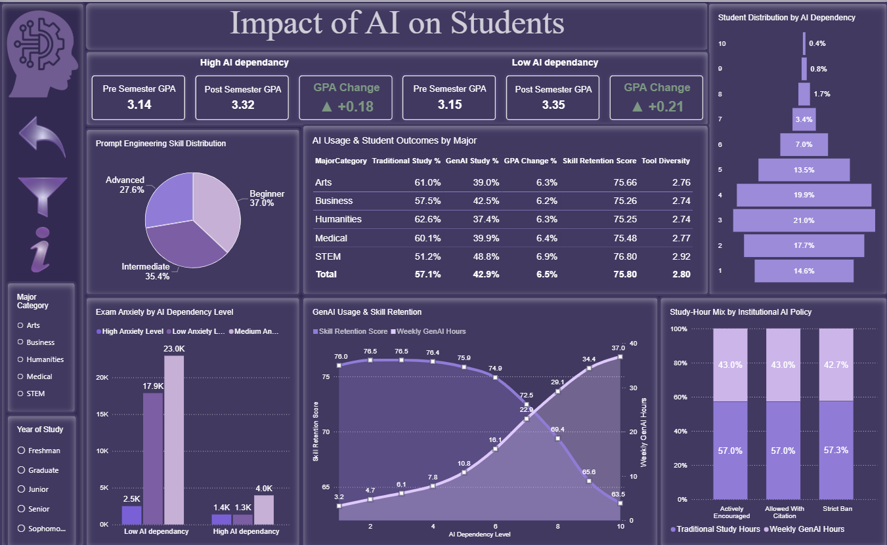
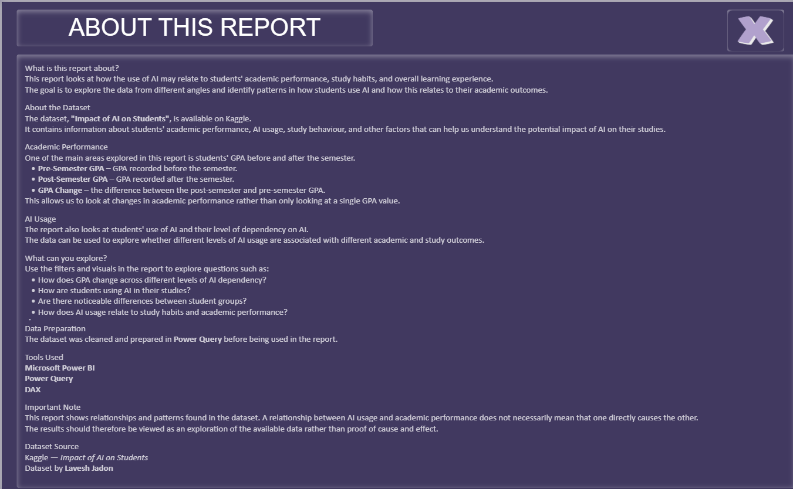

# Impact of AI on Students

A Power BI dashboard exploring how students use Generative AI and how AI usage relates to academic performance, study behaviour, skill retention, exam anxiety and other student outcomes.

### 📊 Live Interactive Report

[▶ View Interactive Power BI Dashboard]([PASTE_YOUR_LONG_POWER_BI_LINK_HERE](https://app.powerbi.com/view?r=eyJrIjoiZmE5ZjM4YjAtYzNjNi00Zjk2LWExMjgtYjIzZDBlZmY3MTZhIiwidCI6ImU4MGE2MjdmLWVmOTQtNGFhOS04MmQ2LWM3ZWM5Y2ZjYTMyNCIsImMiOjh9)

## Project Overview

This project was created to explore patterns in student AI usage and understand how different levels of AI dependency are associated with academic and study-related outcomes.

The dashboard allows users to explore the data across different AI dependency levels, majors and institutional policies.

## Questions Explored

The report explores questions such as:

- How does AI dependency vary among students?
- How does average GPA differ before and after the semester?
- How does GenAI study time compare with traditional study time?
- How is GenAI usage related to skill retention?
- How does exam anxiety vary across AI dependency levels?
- How do AI usage and student outcomes differ across majors?
- How does the study-hour mix vary across different institutional AI policies?

## Dashboard

### Dashboard Overview

### Report Information

## Data Preparation

The dataset was prepared using Power Query before building the dashboard.

The preparation process included:

- Reviewing and cleaning the dataset
- Checking and correcting data types
- Removing unnecessary or duplicate records
- Preparing fields for analysis
- Creating calculated measures using DAX

## Key Metrics

The dashboard includes measures and analysis related to:

- Average Pre-Semester GPA
- Average Post-Semester GPA
- GPA Change
- Skill Retention Score
- Weekly GenAI Usage
- Traditional Study Hours
- AI Dependency
- Tool Diversity
- Prompt Engineering Skill
- Exam Anxiety

## Tools Used

- Power BI
- Power Query
- DAX
- GitHub

## Important Note

This project explores relationships and patterns within the dataset. The results should not be interpreted as proof that AI usage directly causes changes in GPA, skill retention, anxiety or other student outcomes.

The analysis is also dependent on the variables and definitions provided by the original dataset.

## Project Files

- `Impact_of_AI_on_students.pbix` — Power BI report
- `Dashboard_overview.png` — dashboard screenshot
- `Report_information.png` — report information screenshot

## Dataset

The project uses a student-level dataset containing information about AI usage, academic performance, study behaviour and student outcomes.

The original dataset was sourced from Kaggle.

## Author

**Esmira Mamedova**
